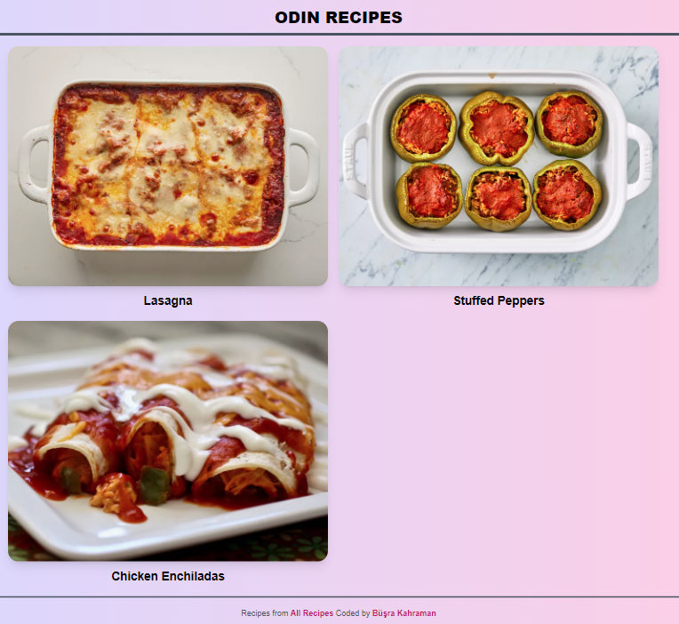
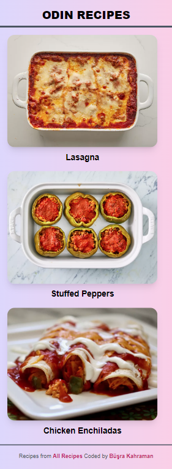

# Odin Recipes

## Introduction

Odin Recipes is a project part of the HTML Foundations section of the Odin Project.

In this project, I chose to utilize Tailwind CSS to style the web pages, providing a hands-on opportunity for me to practice and explore the capabilities of Tailwind CSS.

The project is designed to be fully responsive and was styled following a mobile-first approach.

## Screenshots

